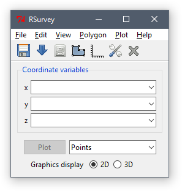

# RSurvey

[](https://travis-ci.org/jfisher-usgs/RSurvey)
[](https://CRAN.R-project.org/package=RSurvey)

## Overview

The [R](https://www.r-project.org/) package **RSurvey** is a geographic information system (GIS) graphical user interface (GUI)
that provides data viewing, management, and analysis tools.

## Install

If R is not already installed on your computer, download and install the latest binary distribution from
the Comprehensive R Archive Network ([CRAN](https://cran.r-project.org/)).
Windows users should set R to operate as a single document interface (SDI) application during installation
by choosing to customize the start-up options and specifying the SDI interface (not the default).

If your operating system is OS X, download and install [XQuartz](https://www.xquartz.org/), and reboot your computer.

**RSurvey** uses the [Tk](http://www.tkdocs.com/) toolkit for GUI rendering,
access to Tk is provided by the **tcltk** package.
To check if Tk is available, startup an R session and type the following at the command prompt

```r
capabilities("tcltk")
```

Support for viewing and editing table data is provided by [Tktable](http://tktable.sourceforge.net/),
a spreadsheet-like Tk widget (typically included with the binary distribution of R).
To check if Tktable is available, use the command

```r
inherits(tcltk::tclRequire("Tktable", FALSE), "tclObj")
```

Finally, install the stable version of **RSurvey** from CRAN using the command

```r
install.packages("RSurvey")
```

In addition to its required packages, **RSurvey** can make use of the functionality in its suggested packages.
If any of the suggested packages are missing, you will be prompted to install them when it first starts up.

## Run

Load **RSurvey** in the current R session using the command

```r
library(RSurvey)
```

The main GUI will open automatically and should look something like this



## Bugs

Please consider reporting bugs and asking questions on the
[Issues page](https://github.com/jfisher-usgs/RSurvey/issues).

## License

GPL-2 or GPL-3.
These are "copy-left" licenses.
This means that anyone who distributes the code in a bundle must license the whole bundle in a GPL-compatible way.
Additionally, anyone who distributes modified versions of the code (derivative works) must also make the source code available.
GPL-3 is a little stricter than GPL-2, closing some older loopholes.

[](https://img.shields.io/badge/License-GPL%20v2-blue.svg)
[](https://www.gnu.org/licenses/gpl-3.0)
